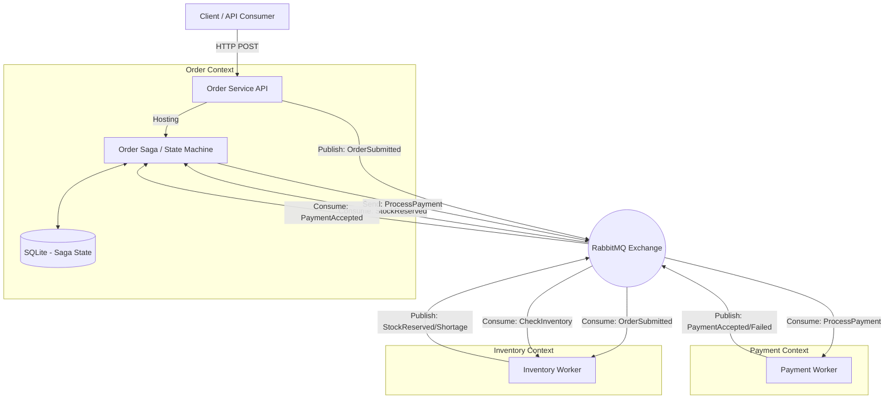

# Technical Documentation: Distributed E-Commerce Order System

## 1. Executive Summary
This document outlines the technical architecture, design patterns, and implementation details of the Distributed E-Commerce Order System. The solution is a high-performance microservices architecture built on **.NET 10**, leveraging **MassTransit** and **RabbitMQ** for event-driven orchestration (Saga Pattern) and **SQLite** for state persistence.

## 2. System Architecture

The system consists of three decoupled microservices communicating asynchronously via a message bus.

### 2.1 Component Diagram


### 2.2 Tech Stack
*   **Framework**: .NET 10.0 (C# 13)
*   **Messaging**: MassTransit 8.x, RabbitMQ
*   **Persistence**: EF Core 10.0 (SQLite)
*   **Containerization**: Docker & Docker Compose
*   **Testing**: xUnit, MassTransit TestHarness

### 2.3 Project Structure (5 Projects)
*   **OrderService**: Web API & Saga Orchestrator.
*   **InventoryService**: Worker Service for stock logic.
*   **PaymentService**: Worker Service for payment logic.
*   **Contracts**: Shared Class Library for Message Interfaces.
*   **ECommerce.Tests**: Integration and Unit Tests.
*   **API Documentation**: Swagger / OpenAPI

## 3. Microservices Breakdown

### 3.1 Order Service (`OrderService`)
*   **Type**: ASP.NET Core Web API.
*   **Role**: Entry point for the system and Orchestrator.
*   **Key Components**:
    *   `OrderController`: Exposes `POST /Order`. Generates a unique `OrderId` and publishes the initial `OrderSubmitted` event.
    *   `OrderStateMachine` (Saga): A MassTransit Automonymous State Machine that defines the business workflow.
    *   `OrderDbContext`: EF Core context storing the state of active and completed sagas.
*   **Saga States**:
    *   `Initial`: Starting point.
    *   `Submitted`: Order received, waiting for inventory check.
    *   `InventoryReserved`: Stock confirmed, waiting for payment.
    *   `Completed`: Happy path final state.
    *   `Failed`: Sad path final state (Stock shortage or Payment rejection).

### 3.2 Inventory Service (`InventoryService`)
*   **Type**: .NET Worker Service.
*   **Role**: Manages stock availability.
*   **Consumer**: `CheckInventoryConsumer`.
*   **Logic (Simulation)**:
    *   Listens for `CheckInventory` commands (triggered by the Saga).
    *   **Rule**: If `OrderId` GUID ends in `0`, publishes `StockShortage`.
    *   **Rule**: Otherwise, publishes `StockReserved`.

### 3.3 Payment Service (`PaymentService`)
*   **Type**: .NET Worker Service.
*   **Role**: Processes financial transactions.
*   **Consumer**: `ProcessPaymentConsumer`.
*   **Resilience**: Configured with a **Retry Policy** (3 retries, 500ms interval).
*   **Logic (Simulation)**:
    *   Listens for `ProcessPayment` commands.
    *   **Rule**: If `OrderId` GUID ends in `1`, publishes `PaymentFailed` (Hard Failure).
    *   **Rule**: If `OrderId` GUID ends in `2`, throws an Exception to trigger the Retry Policy (Transient Failure).
    *   **Rule**: Otherwise, publishes `PaymentAccepted`.

### 3.4 Contracts (`Contracts`)
*   **Type**: .NET Class Library.
*   **Role**: Shared message definitions (Interfaces) to ensure strong typing and loose coupling between services.
*   **Key Messages**: `OrderSubmitted`, `CheckInventory`, `StockReserved`, `ProcessPayment`, `OrderCompleted`, etc.

## 4. Message Flow & Orchestration

The system uses an **Orchestration** pattern where the Order Service (Saga) tells other services what to do via commands and reacts to their events.

1.  **Submission**: User POSTs order -> `OrderSubmitted` event published.
2.  **Saga Start**: `OrderStateMachine` starts, transitions to `Submitted` state, sends `CheckInventory`.
3.  **Inventory**: `InventoryService` consumes `CheckInventory`, replies with `StockReserved`.
4.  **Payment Trigger**: Saga consumes `StockReserved`, transitions to `InventoryReserved` state, sends `ProcessPayment`.
5.  **Payment**: `PaymentService` consumes `ProcessPayment`, replies with `PaymentAccepted`.
6.  **Completion**: Saga consumes `PaymentAccepted`, transitions to `Completed`, publishes `OrderCompleted` event, and Finalizes (removes state from DB).

## 5. Resilience & Fault Tolerance

*   **Retries**: The `PaymentService` uses MassTransit's `UseMessageRetry` configuration. If processing fails (e.g., database glitch), the message is redelivered automatically.
*   **Dead Letter Queue (DLQ)**: If retries are exhausted (e.g., permanent error), the message is moved to a `_error` queue (e.g., `payment-service_error`) to prevent data loss and allow manual inspection.
*   **Compensating Actions**: (Architectural Note) While not fully implemented in this MVP, the Saga structure supports adding `When(OrderFailed)` handlers to trigger compensation (e.g., `ReleaseStock` if Payment fails after Stock was reserved).

## 6. Development & Deployment

### 6.1 Prerequisites
*   .NET SDK
*   Docker Desktop (for RabbitMQ)

### 6.2 Local Execution
1.  **Infrastructure**: `docker-compose up -d` (Starts RabbitMQ Management UI on port 15672).
2.  **Services**: Run `dotnet run` in each project folder (`OrderService`, `InventoryService`, `PaymentService`).
3.  **Database**: `OrderService` will automatically create a local `orders.db` (SQLite) file on startup.

### 6.3 Testing
*   **Integration Tests**: The `ECommerce.Tests` project uses `MassTransit.TestHarness`.
*   **In-Memory**: Tests run without RabbitMQ, using an in-memory bus to verify the Saga logic, state transitions, and message consumption speeds up the feedback loop.

## 7. Configuration Details

Configuration is centralized in `appsettings.json` files for each service, removing hardcoded credentials from the code.

### 7.1 Configuration Files
To modify environment settings (e.g., RabbitMQ host, Database path), update the following files:
*   **OrderService**: `OrderService/appsettings.json`
*   **InventoryService**: `InventoryService/appsettings.json`
*   **PaymentService**: `PaymentService/appsettings.json`

### 7.2 JSON Structure
**RabbitMQ Settings (Present in all services):**
```json
"RabbitMQ": {
  "Host": "localhost",
  "Username": "guest",
  "Password": "guest"
}
```

**Connection Strings (OrderService only):**
```json
"ConnectionStrings": {
  "DefaultConnection": "Data Source=orders.db"
}
```
